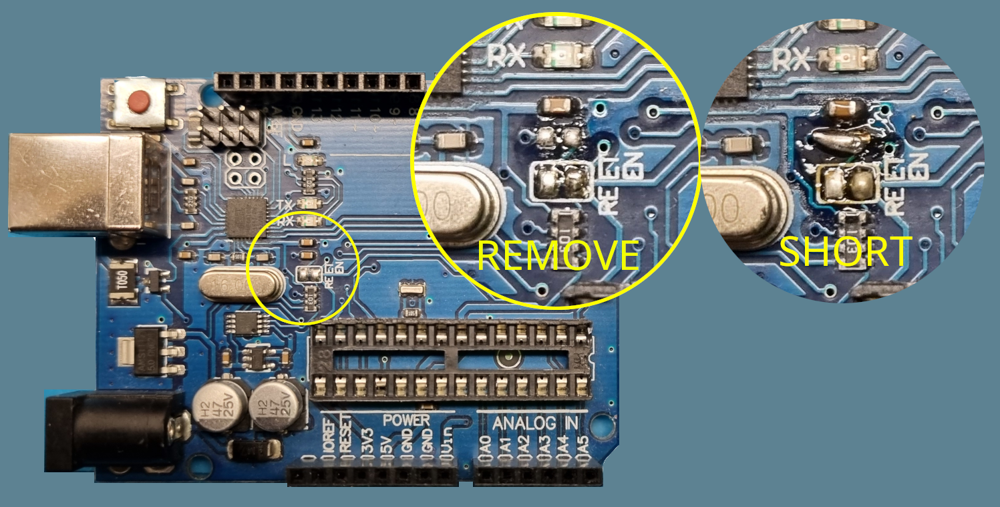
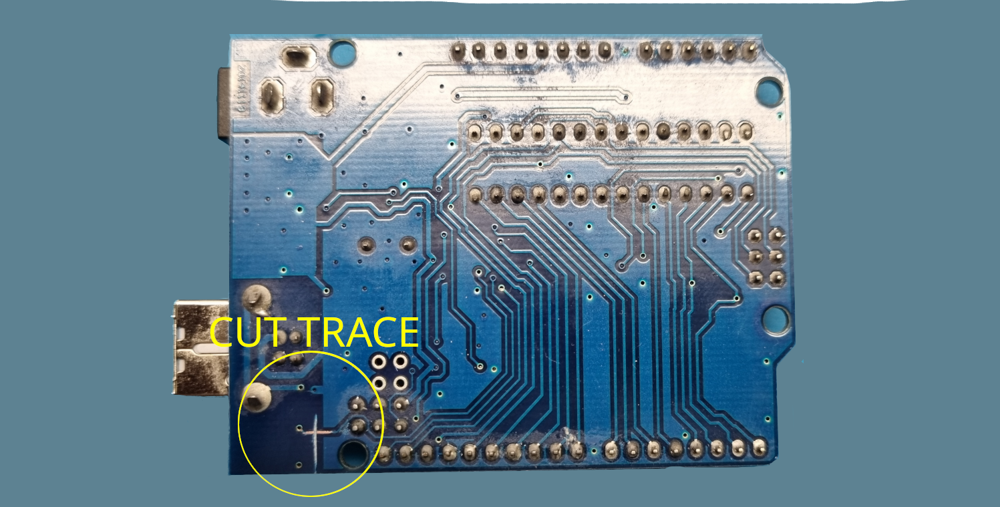
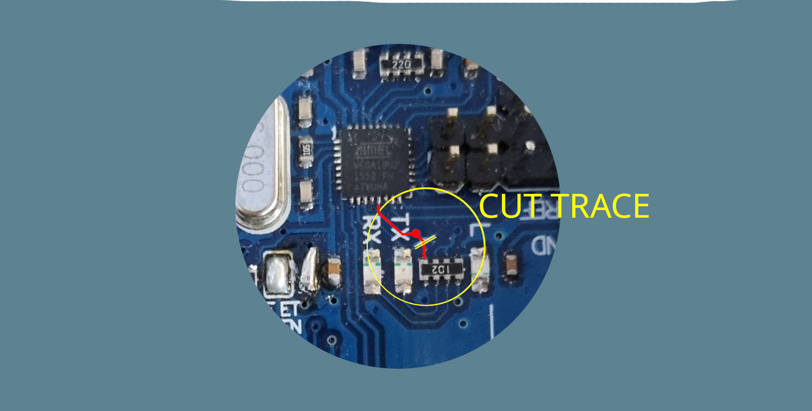
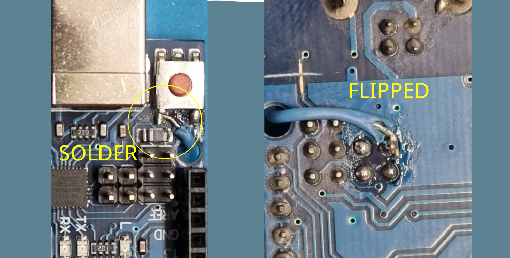

# Ardwino
## DebugWire enabling Arduino board modification

### Table of contents
- [What this is](#what-this-is)
- [What this is not](#what-this-is-not)
- [Modifying an existing board](#modifying-an-existing-board)
- [How it works](#how-it-works)
- [Software tools](#software-tools)
- [Working with avr-gdb](#working-with-avr-gdb)
- [Integrating with IDEs](#integrating-with-ides)
  - [VSCode](#vscode)
  - [CLion](#clion)
 - [Compiling](#compiling)

### What this is

This project is a firmware modification for the ATMega16u2 used on most of the  
Arduino(c) Uno - Nano - Leonardo and clones on the market in order to add 
debugging capabilities of the target firmware.
The chip mentioned above is commonly used as a simple usb to serial converter, delegating
the target flashing operations to the bootloader the target comes pre-flashed with.

This can cause minor problems in case the target flash gets corrupted. In those cases a 
programmer is needed for recovering the chip.

The fact that a full-blown ATMega16u2 is used for a simple task like this 
--Probably for cost purposes because yes, An FT232 costs more than an MCU-- means
that we can exploit the power of the MCU for other purposes by maintaining the 
hardware similar.

With some modifications of the board that will be explained in [Hardware modifications](#hardware-modifications)
we can make the ATMega16u2 as a GDB Server, which can be used to flash the target
without bootloader and enables the possibility to debug the target firmware.

### What this is not

This is not a hardware product nor an Arduino(c) compatible firmware.
This is a standalone firmware that can be _also_ flashed on Arduino(c) or compatible
boards because of pinout compatibility.

### How it works

The ATMega16u2 will be seen by the host operating system as a USB-CDC Device.
The target **does not** implement an usb to serial converter, but communicates to the
software on the host system to debug and flash the target.

The firmware is designed to work with the following connections
```
                    ATMega16u2                            ISP Connector (Out) 
                   +----------------+                           +--+
                   |            MISO|---------------------------|  |
<------------------|USB_P       MOSI|---------------------------|  |
<------------------|USB_N        SCK|---------------------------|  |
<to/from host usb  |         TGT_RST|---------------------+-----|  |
                   |                |                     |     +--+
                   |          LED_DW|--|<|-|RES|---| VCC  | 
     +-|BTN|-------|RST_BTN  LED_GDB|--|<|-|RES|-+-| VCC  |    +----+
     |             +----------------+            +--|RES|-+----|RST |
    ---                                                        +----+
    GND                                                        Target
```

Specifically the connections are the following:

| MCU Pin | MCU Pin Name | Connection                      | Notes                             |
|---------|--------------|---------------------------------|-----------------------------------|
| 30      | D-           | HOST USB-                       | See datasheet for connections     |
| 29      | D+           | HOST USB+                       | See datasheet for connections     |
| 17      | PB3          | ISP - MOSI                      | SPI programming in and out        |
| 16      | PB2          | ISP - MISO                      | SPI programming in and out        |
| 15      | PB1          | ISP - SCK                       | SPI programming in and out        |
| 20      | PB6          | pushbutton to gnd               | target reset switch               |
| 11      | PD5          | Led with resistor from vcc      | GDB Led indicator                 |
| 10      | PD4          | Led with resistor from vcc      | Debug Wire Halted led indicator   |
| 13      | PD7          | Target ~RST/dW with Pull up 10k |                                   |
| 13      | PD7          | ISP - Reset                     | Used for isp programming a target |

When started, the firmware will try to halt, reset and restart the target MCU.
After this operation, avr-gcc can be used to connect to the server through the virtual
serial exposed by the usb endpoint and enter the debug session. (see [Working with avr-gdb](#working-with-avr-gdb))

Target flashing can be archived with gdb restore command inside a debug session.
_Note: Final flushing occurs when a non memory related command is issued after the
memory write. Be sure to detach after flashing._

The only exception to the workflow occurs when the serial connection is made with a 
(virtual) baud rate of 1200 baud. (Virtual baud rate is what the control structure is set to;
on usb CDC devices communication happens at max usb speed)

In this case the firmware will behave as a serial to SPI converter, by disabling the debug
wire activities and pins and gdb activities for writing on the SPI bus with target 
reset line constantly low. (some avr have reset active high, those are not compatible)

Every character sent from the serial communication will be sent on the SPI bus and any response 
received will be replied to. An avrdude programmer will be written in the future.

The optional external reset button causes the MCU to perform a target reset and execution 
continue directly without the needing of a gdb session running.

#### Real Time Terminal Support

One additional feature implemented in the gdb server is the support for a communication channel
for sending debug information to the host while the target is running.

Usually this process is archived by relying on a real serial connection between the target and the 
host and making the target bootloader responsible for the flashing the program onto it or
by allocating two different USB descriptors from the "programming" MCU in order to be seen by 
the host system as two different serial adapters (composite device) and then relying on a phisical
channel for communication.

This alternative uses a buffer allocated in the SRAM of the target (placed in a known location, on
top of the SRAM in a non-initialized region with the help of a linker script) 
and the cooperation between the target and the debugger for the transfer.

On reset the debugger chip writes a 0 in a target SRAM location which represents a flag (`rtt.enable`) 
for the effective presence of a debugging session.
This write does not cause any trouble for the program running on the target because neither the 
libc code has run, so, if the target does not support rtt, it will simpy overwrite the flag on init.

The user has then the possibility of enabling the rtt with a monitor command [see monitor rtt](#monitor-rtt)

When the target needs to send data to the host, it will set the flag `rtt.available`,
will write the length of the message in a specified location and will copy the data in the buffer; then it will break.

The debugger, when receiving an unexpected break from the target giving that rtt has been enabled
by the user, checks for the `rtt.available` flag.
If that is not set, proceeds in signaling a SIGTRAP event to the debugger, else 
it will read the data from the buffer sending it to the debugger (see gdb `'O'` packets)
and will continue the execution resetting the `rtt.available` and `rtt.size` both to `0x00`

This mechanism allows for a single direction communication from target to host on the already 
existing debug wire connection, making other physical channels available for user development.

### Modifying an existing board

Because of pinout compatibility, this firmware can be flashed on an Arduino(c) board
(UNO or alike, Uno is the only board this has been tested on.)

#### Firmware upload
The ATMega16u2 comes with a USB bootloader flashed.

(See [the official arduino guide](https://docs.arduino.cc/hacking/software/DFUProgramming8U2#reset-the-8u2-or-16u2))
for a detailed guide.

In order to enable the bootloader we need to plug in the usb cable and, after usb enumeration,
reset the MCU by short circuiting the pins 5 and 6 of the nearby `ICSP` connector [As described in the datasheet sec. 23.6.3](https://ww1.microchip.com/downloads/en/DeviceDoc/doc7799.pdf).

After a successive enumeration the device will be recognised as usb device `03EB:2FEF Atmel Corp. atmega16u2 DFU bootloader`
(_Note for linux users: In order to correctly use the programming software you'll need to update your udev rules accordingly or use sudo (**BAD** person)._)

Now we are ready for flashing:
 - Install the programming software (listed below) 
   - **Windows**: Microchip Flip programming tool is required [See here](http://www.microchip.com/developmenttools/productdetails.aspx?partno=flip)
   - **Linux**: Install dfu-programmer (available from apt/aur)
   - **MacOS**: Install dfu-programmer with MacPorts
 - Upload the firmware compiled hex file [See Compiling](#compiling)
   - **Windows**: Use Flip
   - **Linux/MacOS**:
     ```bash
     $ dfu-programmer atmega16u2 erase
     $ dfu-programmer atmega16u2 flash <ardwino.hex>
     $ dfu-programmer atmega16u2 reset
     ```

**NOTE**: After modifiying the board (Step 3), the bootloader will not automatically trigger anymore.
In order to access the bootloader short-circuit the cut track at step 3 with something pointy across pushed into the cut.

#### Hardware modifications

In order for the firmware to work, some modifications are needed:
(References are made from the official Arduino Uno R3 Schematics [available online](https://www.arduino.cc/en/uploads/Main/Arduino_Uno_Rev3-schematic.pdf))
 1) Remove and short-circuit `C5`
 2) Cut the trace connecting `RESET` button to the target reset pin.
 3) Cut the trace connecting to `RN2D`
 4) Add a jumper wire from the `RESET` pushbutton to pin 2 (PB6) of `JP2`






### Software tools

todo

### Working with avr-gdb

The integrated GDB server implements all the common commands for debugging.
particularly it consents to:
 - Read and write registers
 - Read and write memory: Addresses are the same as used in avr-libc as specified in the table below.

| Memory Type | Sub Space   | Offset   |
|-------------|-------------|----------|
| Flash       |             | 0x0      |
| SRAM        | Registers   | 0x800000 |
|             | I/O Space   | 0x800020 |
|             | Ext I/O (1) | 0x800060 |
|             | Memory (2)  | 0x800100 |
| EEPROM      |             | 0x810000 |
(1): Only for parts with extended I/O
(2): Only for parts with extended I/O. Other parts will offset at `0x800060`

 - Breakpoint management
 - Detaching
 - Reset
 - Real Time Monitoring (Debug Console) without allocation of the serial interface.

With the above-mentioned packet set it is possible to use the majority of the available 
functionalities included in most IDEs.

#### Monitor commands

Monitor commands implement custom features specifically for the device/family the server is
implemented upon.

This embedded server allows for the following monitor command:
##### monitor signature
Syntax: `(gdb) monitor s[ignature]`

This commands returns and prints out a hex representation of the 16bit debug wire device signature
read from the connected target.

##### monitor reset
Syntax: `(gdb) monitor re[set]`

This command resets the target to the internal default state and points the Program Counter to 0x0.
This command does not continue execution

##### monitor rtt
Syntax: `(gdb) monitor rt[t] (e[nable] | d[isable])`

This command enables the real time terminal support in case the target mcu has a firmware 
implementing this functionality. [see Real Time Terminal Support](#real-time-terminal-support)

##### monitor disable
Syntax: `(gdb) monitor d[isable]`

This command disables debug wire until next power cycle.
This causes the reset line to behave like a normal reset for a successive ISP programming. 

##### monitor timers
Syntax: `(gdb) monitor t[imers] (e[nable] | d[isable])`

This command sets if the timers should run during single stepping and instruction execution.

#### Breakpoint management

Breakpoints are managed in "lazy" mode: the opcode will be placed in memory only on continue or stepping.
This prevents flash wear and long wait times for breakpoint operations.
This causes the real available breakpoints to be half of the allocated space in some cases, because
a breakpoint will only be marked inactive but not removed until flush.

#### Flashing and verifying

Memory write commands allow for flashing inside the debugger.
A script is written to help in this procedure.

### Integrating with IDEs
#### VSCode

todo

### Compiling

Some software is required in order to compile:
 - avr-libc
 - avr-gcc
 - avr-binutils
 - cmake
 - avr-gdb (to use the server (: )

In order to use the host software, you'll need to install python and pip,
then you can install all the dependencies with `pip install -r host_software/requirements.txt` 

Go to the repository directory and do the following:
 - execute `cmake -DCMAKE_BUILD_TYPE=Debug -S . -B build`
 - execute `cmake --build ./build --target ardwino`

The flash hex file will be available at `./build/ardwino.flash.bin`
